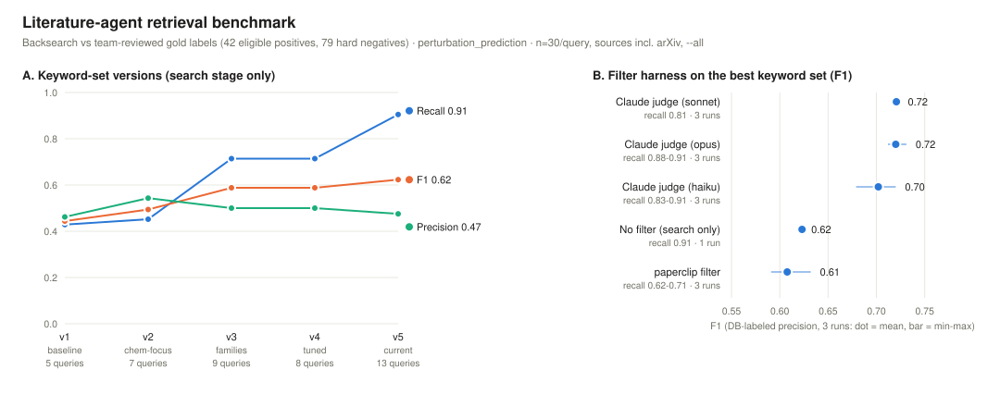

# Backsearch evaluation

Validates the literature search agent by asking: **if the papers we already
know are relevant had just been published, would our search find them — and
would it avoid finding irrelevant ones?**

## Setup

Gold labels come from the curated DB (`db/perturbation_model_papers.csv`):

- **positives** — papers relevant to the benchmark (per the relevance rule in
  the benchmark's `benchmark.yaml`, plus manual `force_positive` overrides)
- **negatives** — in-domain hard negatives (perturbation-modeling papers with
  no established chemical applicability)
- **related** — papers from `db/perturbation_benchmark_papers.csv` (benchmark
  papers, not methods): retrieving them counts as neither TP nor FP
- **unknown** — retrieved papers absent from both DBs: written out for human
  review, never silently counted as false positives

## Pipeline being evaluated

Two stages (both configured in the benchmark's `keywords.yaml`):

1. **Broad keyword search** — `paperclip search` over pmc,biorxiv,medrxiv with
   several queries covering the benchmark's subtopic vocabulary. Tuned for
   recall 1.0.
2. **LLM relevance filter** — `paperclip filter` with the benchmark's
   `relevance_filter` criterion, applied per query result set; a paper
   survives if any set keeps it. Restores precision.

## Corpus-coverage caveats (measured 2026-08)

- **Without `--all` (or an explicit `--year`/`--since`), `paperclip search`
  silently restricts to recent papers (~late 2024 onward) and returns nothing
  for arXiv.** An over-filtered search is indistinguishable from an empty
  corpus — always pass `--all` for backsearch, or `--since` for scheduled
  new-paper runs.
- With `--all`, coverage by source (probed by year): PMC ≥1980→present,
  arXiv ≥2006→present, bioRxiv 2014→present, medRxiv 2019→present.
  arXiv ingestion lags ~1–2 months (June 2026 present, July 2026 absent).
- arXiv papers have deterministic doc ids (`arx_<arxiv_id>`, constructible
  from `10.48550/arXiv.*` DOIs) but are absent from `lookup` and unreliable in
  `sql` — resolve them by constructing the id and verifying with `ls`.
- Some papers are still unreachable per-document (not ingested, or paywalled
  with no PMC/preprint version) — the eval reports them as coverage gaps and
  excludes them from retrieval metrics.

## Results (perturbation_prediction)



Benchmark suite (2026-08-16), scored against team-reviewed gold labels
(42 eligible positives, 79 hard negatives), n=30/query, full corpus incl.
arXiv. Reproduce with `scripts/benchmark_retrieval.py`.

Keyword-set versions (search stage only):

| set | queries | recall | precision_db | F1_db |
|-----|---------|--------|--------------|-------|
| v1 baseline | 5 | 0.43 | 0.46 | 0.44 |
| v2 chem-focus | 7 | 0.45 | 0.54 | 0.49 |
| v3 families | 9 | 0.71 | 0.50 | 0.59 |
| v4 tuned | 8 | 0.71 | 0.50 | 0.59 |
| v5 current | 13 | **0.90** | 0.47 | **0.62** |

Filter harnesses on the best set (3 runs each; F1 mean and min–max):

| harness | recall | precision_db | F1_db |
|---------|--------|--------------|-------|
| no filter (search only) | 0.90 | 0.47 | 0.62 |
| paperclip filter | 0.62–0.71 | 0.56–0.57 | 0.61 (0.59–0.63) |
| claude judge, haiku | 0.83–0.91 | 0.54–0.62 | 0.70 (0.68–0.72) |
| claude judge, sonnet | 0.81 | 0.64–0.65 | **0.72** (0.72–0.72) |
| claude judge, opus | 0.88–0.91 | 0.59–0.61 | **0.72** (0.72–0.73) |

Takeaways: keyword recall was bought by adding vocabulary-family queries
(0.43 → 0.90) at flat precision; the abstract-based claude judge beats both
no-filter and paperclip's snippet-based filter (which pays for its precision
with a large recall loss — arXiv results carry no snippets); sonnet and opus
tie on F1 with different recall/precision trade-offs, and haiku is close.
`precision_db` judges only papers with a known DB label. The LLM filters are
stochastic — ranges are across repeated runs of the same config.

Lessons that transfer to other benchmarks:

- semantic search is highly phrasing-sensitive: over-specific queries (v2)
  lose recall catastrophically; one query per subtopic vocabulary family
  (generative-model type, transfer setting, baseline methods, task phrasing)
  is what reached full recall
- broad search + LLM filter beats trying to make keywords precise
- match retrieved papers by normalized title, not just doc id (bioRxiv holds
  several versions of one paper under different ids)

## Reproducing

```bash
python3 scripts/extract_gold_set.py benchmarks/perturbation_prediction
python3 scripts/annotate_reachability.py benchmarks/perturbation_prediction
python3 scripts/run_backsearch.py benchmarks/perturbation_prediction <run_name> --filter
```

Results land in `evals/backsearch/results/<run_name>.json` (gitignored —
one-off run outputs stay out of git; final numbers are summarized here and in
the benchmark figure). Historical keyword-set versions are inlined in
`scripts/benchmark_retrieval.py`, which compares them and the filter
harnesses (paperclip filter vs claude judge per model) in one suite.
